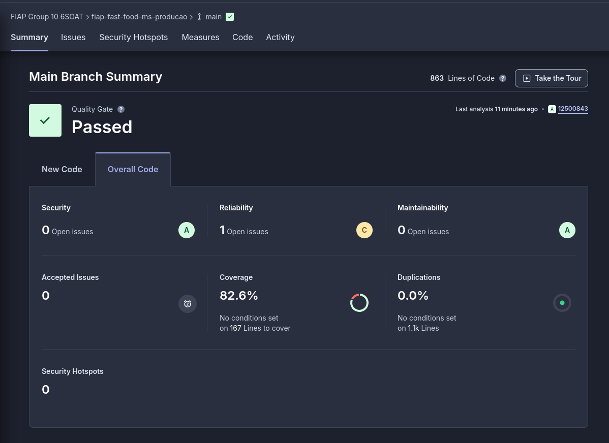

# FIAP Fast Food - Microsserviço de Produção

Este repositório contém o código-fonte do Microsserviço de Produção, desenvolvido como parte do Projeto da Fase 4 da Pós-Tech da FIAP.

## Descrição

O Microsserviço de Produção é responsável por gerenciar os processos de produção no sistema de Fat Food, incluindo o controle de pedidos, atualização da preparação de alimentos e atualização de status de produção.

## Estrutura do Projeto

```plaintext
├── adapter/    # Adaptadores para conectar domínio a outras camadas ou serviços externos
├── domain/     # Entidades e regras de negócio
├── infra/      # Implementações de infraestrutura, como banco de dados e rede
├── main/       # Ponto de entrada da aplicação
├── mocks/      # Implementações de mocks para testes
```


Abaixo, você pode conferir uma captura de tela que mostra a cobertura do código



